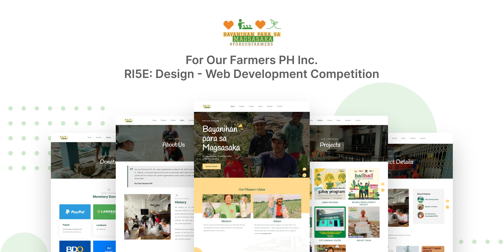

  

<h1 align="center"> For Our Farmers PH Inc. </h1>

  
  Design: A Pre-Event Competition and Outreach is a front-end web development competition that also serves as the outreach event of R15E: A Computer Science Convention celebrating the 15th anniversary of FEU Tech ACM. 

  Participants are expected to utilize their knowledge of front-end web development, from designing to implementation. The chosen beneficiary, For Our Farmers PH Inc. will be able to use the design created by the winner.

  

  

  

